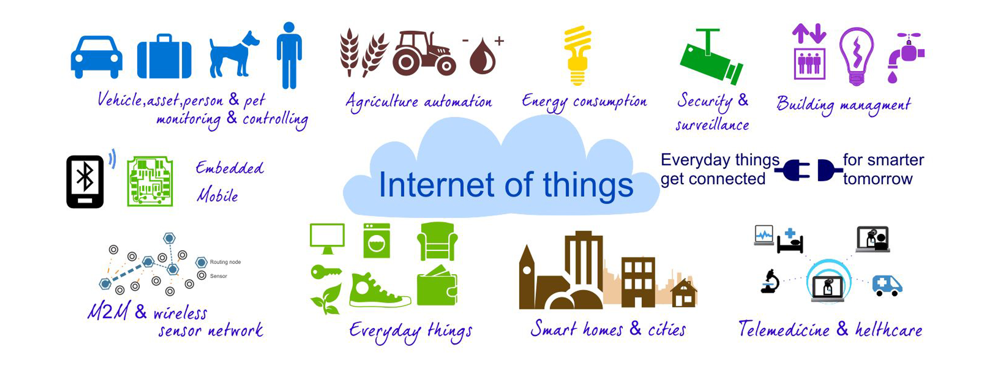

title: Co nowego w APIs?
author: Jacek Młynek

!SLIDE

## API Days in Berlin bylo spoko, ale gdzie jest Wally?

!SLIDE

## Moze i u nas by to przeszlo ... 

!SLIDE 

## Dowiedzialem sie ze wiele marek mocno inwestuje we wlasne API

!SLIDE

## Dowiedzialem sie o wielu nowych narzedziach

* #### RunOfScope - monitoring, traffic oraz test API
* #### Stamplay - nastepna generacja 'platform as a service'
* #### 3scale - kompleksowe rozwiazanie - documentations, cloud or on premise hosting, access control 
* #### mailjet -  serwis zajmujacy sie wysylaniem maily, dzialajacy jak API
* #### MuleSoft - narzedzia do tworzenia interaktywnej dokumentacji

!SLIDE

## ... 

!SLIDE

## Dowiedzialem sie że pisac kod można po 50-tce

!SLIDE

## Dowiedzialem sie co znaczy w koncu IoT i jaki ma zwiazek z API

    Internet of things  is a scenario in which objects, animals or people are provided with unique identifiers and the ability to transfer data over a network without requiring human-to-human or human-to-computer interaction.
                                                                          ~Google 

!SLIDE

## Przede wszystkim zrozumialem

    Nie jest możliwe stworzenie dobrego softu bez poznania jego ograniczen. Czyli nie tylkoo unit test i logi czy monitoring ale tez - load tests, security tests.

.
 
    Public API to nic innego jak system dystrybucji taki jak HTTP czy nawet zwykla strona internetowa

!SLIDE

## Podstawowa własność systemu dystrybucji

    Jak najbardziej luźne powiązanie pomiędzy providerem a clientm !

## Dlaczego?

    Aby zmiany providera w jak najmniejszy sposób wpływały na klienta. Szczególnie ważne w momenice kiedy mamy bardzo dużo róznych klientów.

!SLIDE

## No ale dlaczego

    Wyobraźcie sobie strone internetowa która aby działać poprawnie za każdą zmianą musi wysłać notyfikacje do swoich klientów i czekać aż dostosują się do tej zmiany.

    Nie brzmi dobrze, co?

!SLIDE 

## Jak to osiagnac? 

* ### Wystawić jak najmniejszy interfejs publiczny
* ### Komunikować się za pomoca dobrze zdefiniowanch i powszechnie zintegrowanych rzeczy np. text, HTTP
* ### Discoverability
* ### Zweryfikować czy nie eksponujemy wewnętrznej logiki do klientów
* ### Starać tak wprowadzac zmiany aby nie musiec wersjonowac

# Przykład - Acturis.API

 

