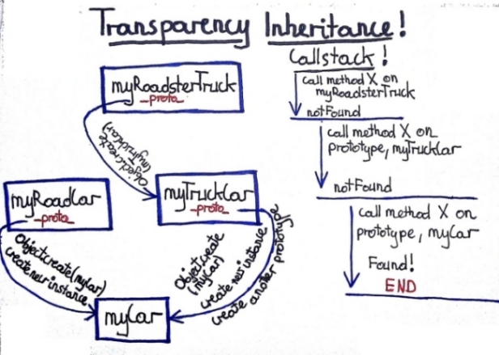

title: Old body young soul
author: Jacek Mlynek

!SLIDE

## Why javscript in this way?

### You are not bored, when you start learning new language from its bases (types, loops, classes ...)?

Why you always start from theB beginning? Why we learn something which is almost the same  in all languages?  

### The best way to get better with something is learning its distinctive features.

If you know well other languages, you should start from the biggest differ features. You should start from something which we can call _"ideas behind language"_.

### What can be more specific for languages if not its own "body" and "soul"? :)

Body represents something which you can touch, something which can use up. Soul are all stuff which remains the same no matter how old are you. 

!SLIDE

## It is not only about javascript!

### First of all I must say that me and javascript, that we are not in "love"! :)

We are just "friends". It is for those who know me and really don't understand my simply interest with javascript. 

### It is specially for those with a lot of experience.

It is really something big if you convince guys with many years experience, with master skills in such a languages like Java or Ruby put theirs attention to this tiny languages starting with small "j". There is something money can't buy :)   

!SLIDE

## What for? 

### Not for writing better javascript code!

I will not try convince you to get better with javascript for better js code. Maybe you will not have to, maybe you will. Maybe in the next year we can deal with "super magic" DSL (better than coffee script), which do all work for us.

### For writing better code!

If you can understand the good and bad idea behind some language you can search it or omit in another.   
I will try convince you to "use" this simply language as a _"excuse"_ to better understand object oriented programming.   

!SLIDE

## How can we meet js?

### Back to past.

We try to remembered how programming use to look like and how it has changed. We look in this context to javascript.

### Through today to get to tomorrow.

We will see if javascript besides of its age and "body" is in step with mainstream languages such as ruby.

!SLIDE

## Simple is beautiful!

### First time go back to past and look how it has changed:
    
* from procedural to functional programming, 
* from machine code to languages close to domain, 
* from cryptic symbols to very _"plastic forms"_.
    
Back to your childchood, try to remembered your first steps. Methods with many lines of codes, programs base on one class, conditions almost looks like [De Morgan's laws](http://en.wikipedia.org/wiki/De_Morgan%27s_laws).

    We can learn from a few developers generations, that if somthing is less complicated than it is better.

!SLIDE
   
## Javascript is simple!

* ### simple object literal notation (_json_ is subset of it),
* ### easy to form - easy to extend,
* ### duck typing,
* ### _closur_ aka block,
* ### class free,
* ### just few build in types - easy to learn.

!SLIDE

## Simple object example.
    
    var pussInBoots = {
        weight: 11,
        speed: 10,
        numberOfMouseKilled: 3,
        danceSkillLeve: "low",
        eye: "very dark",
        drinkWine: function() {},
        takeOffBoots: function() {}
        };

## Nice, but how can I create a group of objects.

!SLIDE

## This is how _"professionals"_ deal with it!

### Class's World.
From many years, through such a languages like C++, Java, C# and even Ruby, the base way to create new object instance is _Class_.  

### Common base class responsibility:
* object creation,
* place for common object behevior and data.

### Common class problems especially in business logic layer:
* bad understand DRY principle goes to wrong class inheritnace (domain class inherit from tools class)
* strong inheritnace relationship can very easy violates [SRP](http://pragmaticcraftsman.com/2006/07/single-responsibility-principle/), [LSP](http://blog.objectmentor.com/articles/2008/09/06/the-liskov-substitution-principle-for-duck-typed-languages).

!SLIDE

## Novice naive example.
    We have a domain class Invoice. Invoice have a lot of fields like total price, tax, payment date and few behaviors.
  
    After some time our client request for pdf, html and csv invoice support. Some "guy" who may not understand very well DRY has found tool Printer which actually do all the work. He inherit Invoice from Printer. He think that this functionality comes for free. Everything works well, he is happy.
 
### However, he violated a few bases rules and principles:
* First of all he made dependency in his domain from much less important tool.
* Violated SRP. Invoice now is effected by Printer class changes which can anforce Invoice to change with Printer.

!SLIDE

## Classic shapes example.
  
It is well know example with shapes. Like square and rectangle and area calculation. I think just everybody knows those examples if not [see this](http://www.google.com/url?sa=t&rct=j&q=violate%20liskov%20substitution%20principle%20squer%20rectangle&source=web&cd=1&ved=0CCQQFjAA&url=http%3A%2F%2Fwww.objectmentor.com%2Fresources%2Farticles%2Flsp.pdf&ei=8OGKT4PvOaOJ4gSa08mNCg&usg=AFQjCNFnNI0DmzofjWDQEGILAT-W1L8Mtw&cad=rja) or [read this](http://www.amazon.co.uk/Principles-Patterns-Practices-Robert-Martin/dp/0131857258/ref=pd_rhf_se_p_t_1).
     
    The idea behind "shapes examples" is that if you inherit and change base behaviours you can very easy violates contract between collaborator and his client. It is much more harder to see than violation from previous example because it can be see only in term of client. Not in isolation.

### Its violates LSP because square is not rectangle in client of calculate rectangle area.

!SLIDE

## Still far away from the domain. 

### The Good and the Bad example.
    
    Priest, particularly good and honest. He help poor people, give them food, cloths. He try to teach other how to live and not hurt anybody. However, when night comes, he become thief and still charities.  
   
    In real World the same object (priest) can has many different behaviours "the good man" and "the bad man". In our code will be impossible to create class which contains behaviours for "the good" (priest) and the bad (thief) without violating SRP principle.

!SLIDE

## Problem.
* First of all class are not unique, the same violation of principles can be done with modules or functions. Maybe with classes it is much more easier maybe not.

* The problem is that, OOP was create to close our code to domain. In this case in many languages classes have significant role. However, it seems to the same classes keep as still far away from domain.

### Maybe it is time to look at object in different way? Besides OOP is about objects not necessary about classes. 

!SLIDE 

## Question.

### OK. But object without class? It is really possible?

### If it is even true, can it help in some way? 

!SLIDE 

## Go back to nature!

    Forget for a moment about classes. Make one step back and try remembered on what OOP creators base on. Go back to the nature.     

***    

    In nature one concrete specimen has been "created" by other concrete specimen. Not by some kind of "still life".

***

    Dog, cat, capybara, fly, duck are "creating" by other dogs, cats, capybara, flies, ducks. Not by plastic dogs plush cats, jelly capybara, mechanical flies or steel ducks.

!SLIDE

## _MyCar_ as simple prototype.

  
 [__See code example__](./samplesInHtml/transparentInheritance.html "Transparent Inheritance")

!SLIDE 

## Idea behind _prototype_.

### Prototype is just other way to create object and share common behaviour.
  
#### How it works? 
It allowed us to create new objects base on other objects - like in nature. 

    I love my first car so much that I want my next cars (myRoadCar, myTruckCar, myRoadsterTruck) look almost the same like myCar.

#### It is very important to understand transparent inheritance. 
No matter if we create new instance or new group of objects it looks exactly the same.
    
    MyRoadCar is like "next instance" of myCar, myTruckCar is full working truck but is also something more. It is base (parent) for myRoadsterTruck. 

!SLIDE 

## What we get?

* ### Simplest object creation and code sharing.
We don't need anymore additional abstraction like class. All what we need is object and piece of code.

* ### Transparent _"inheritance"_.
In the same way we can create "new instance" and new group of objects. 

* ### Sharing code by delegation, help with SRP.
One solution for wrong inheritance which violates SRP (Invoice and Printer example) can be _composition_. In javscript through _prototype_ we get it for free. It is natural, easy and without any overhead. 

### By the way, sharing by delegation sounds quit familiar, doesn't it?

!SLIDE

## Ruby footprints - Mixin.js.
Ruby mixin example:

{{{module Printable
  def print_to_pdf
    puts "Text as pdf: #{self.details}"
  end
  
  def print_to_html
    puts "Text as html: #{self.details}"
  end
   
  def print_to_csv
    puts "Text as csv: #{self.details}"
  end
end
   
class Invoice
  include Printable
  attr_accessor :details
end
   
tv_invoice = Invoice.new
tv_invoice.details = "tv invoice for march equal 120 pln"
tv_invoice.print_to_pdf if tv_invoice.respond_to? 'print_to_pdf' 
   
mobile_invoice = Invoice.new 
mobile_invoice.details = "mobile invoice for april 89 pln"
mobile_invoice.print_to_csv if mobile_invoice.respond_to? 'print_to_csv'
}}}

!SLIDE

## Ruby footprints - Mixin.js. 
Javscript mixin example:

{{{(function(){
  var printable = {
    printToPdf: function() {
        console.log("Text as pdf: " + this.details);
      },
    printToHtml: function() {
        console.log("Text as html: " + this.details);
      },
    printToCsv: function() {
        console.log("Text as csv: " + this.details);
      }
  };
           
  var invoiceMaker = function()
  {
    var _details;
    var _that = Object.create(printable);
       
    _that.details = _details;
          
    return _that;
  };
   
  tvInvoice = invoiceMaker();
  tvInvoice.details = "tv invoice for march equal 120 pln";
  if(tvInvoice.printToCsv !== undefined) tvInvoice.printToCsv();
     
  mobileInvoice = invoiceMaker();
  mobileInvoice.details = "mobile invoice for april 89 pln";
  if(mobileInvoice.printToHtml !== undefined) mobileInvoice.printToHtml();
})();
}}}

!SLIDE

## The devil is in details?
Generally example in Ruby and Javascript do the same thing - delegate some behaviours to new instances.  

### Maybe "what" is not important. Maybe "how" is a key?
1. If we have duck typing and our client doesn't care from who he get, but if or if not. So we really need class type?
2. Module. Do we really need it to "augment" abstraction. In Ruby when we create object using class Module is necessary to place only abstraction. In Javascript we don't need it because it doesn't matter if we create new group of object or simple new instance. We do it in the same way. Besides we can use domain to augment abstraction. Simple name it Printable not Printer.    

### So if we can achieve the same goal, but much easier maybe Javascript is not so old?  

!SLIDE

## Recap.

* Object Oriented Programing is about objects not classes.
* Classes are not only way to create objects.
* Classes inheritance can very easy break SRP and LSP.
* Delegation seems to be the right solution for "wrong inheritance" and SRP problems.
* In Ruby in Javascript delegation is natural and comes for free.
* In Javascript is even easier because we don't need additional abstractions such a classes or modules.
    

        After all Javascript like for old man seems to be very fresh. It also seems to be ideally language for domain driven maybe using DCI, who knows :). 

