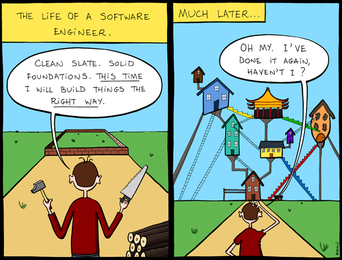
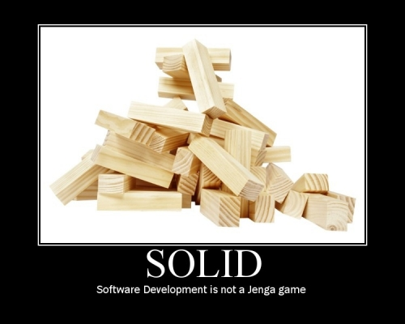
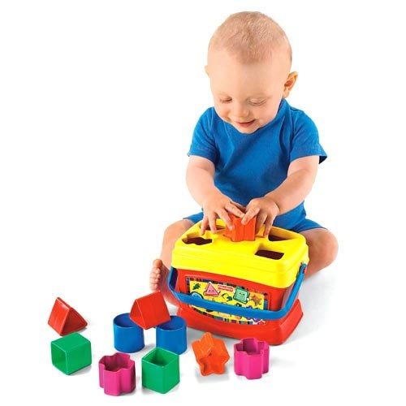
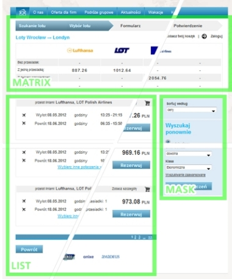
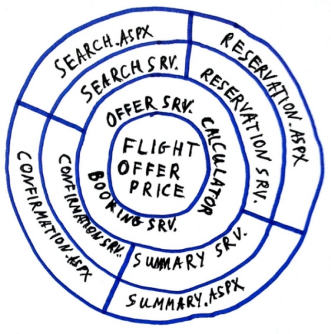
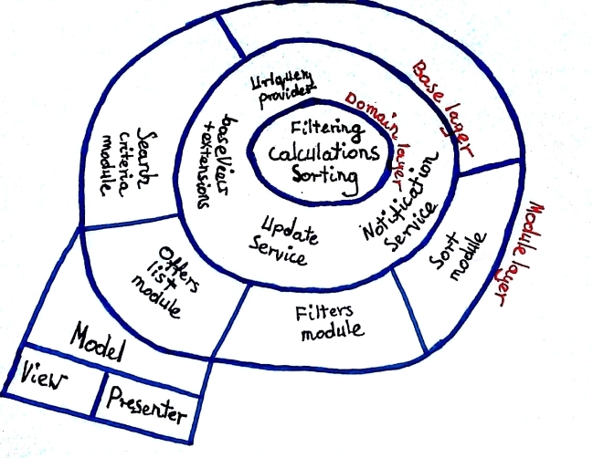

title: Cebula ma warstwy
author: Michał Zając, Jacek Młynek

% jacekm - wstęp

% mzaj

!SLIDE

## Ciekawostka - long-life systems

    Czy wiecie, że niektóre systemy żyją dłużej niż pół roku?

!SLIDE

## Nasza aplikacja
 
* #### Od 5 lat nieprzerwanie na PRD
* #### Podstawowy booking engine dla 60 agencji turystycznych
* #### 44,000 linii produkcyjnego kodu w _C#_
* #### 18,000 linii produkcyjnego kodu w _Javascript_
* #### 1,200 testów
* #### 40 release'ów
* #### Integruje około 10 podsystemów

% jacekm

!SLIDE

## Pamiętacie Boba?
% Taki może nawet nie duży system nie bylby możliwy gdybyśmy byli bobem budowniczym.

% w naszej paroletniej pracy widzielismy często programistow ktorzy sostawali w spadku jakis system. Pierwsza rzecz jak% a z reguly narzekali na niego i zaczynali prepisywac od nowa. Po jakims czasie na ich miejsc przychodzili nastepni wi % dzialo sie tak samo.

% o tym ostatim zwlaszcza wam opowiemy.

!SLIDE

## Architektura ewoluuje 
    
    Dobra architektura to nie tylko dobry projekt. Dobry projekt to dopiero początek, o architekturze trzeba myśleć cały czas.
% podkreśliłbym, że to drugie (ciągłe utrzymanie) jest tak naprawdę istotniejsze niż dobry up-front design 

!SLIDE

## Architektura ewoluuje 

    Dobry system można łatwo zepsuć.

!SLIDE

## Architektura ewoluuje 

    Słaby system można przywrócić do życia.

% mzaj

!SLIDE

## Co zastaliśmy

* #### Big Ball of Mud
* #### Najbliżej do Transaction Script
* #### Brak separacji logiki i infrastruktury
* #### Brak świadomego zarządzania zależnościami
* #### Bardzo duża duplikacja
* #### Javascript, którego każdy się bał (jeden wielki antypattern)

#### Jednym zdaniem:
    Kruchość + brak testów = katastrofa!
% klasyczny legacy code

!SLIDE

## Co nas skłoniło do zmian

* #### Bardzo niska niezawodność systemu
Issue list potrafiła osiągać kilkadziesiąt pozycji w miesiącu

* #### Bardzo dlugo trwające update na PRD
Niekiedy nawet cały dzień :), bez powodzenia    

* #### Brak jakichkolwiek buildów
Systemu nikt nie potrafi uruchomić

* #### Perspektywa paru lat utrzymania
System przypominał maratończyka po maratonie kiedy ciągle miał sporo trasy przed sobą

* #### Potrzeba ciąglej rozbudowy
Ciągle pojawiały się nowe requesty od klienta oraz nowi klienci

!SLIDE

## Pierwsze kroki
% working with legacy code
* #### Pierwsze testy jednostkowe
* #### Sprzątanie nieużywanego kodu
* #### Eliminacja duplikatów
* #### Grupowanie powiązanych zagadnień
* #### Świadome kroki w kierunku izolacji
% jacekm
* #### Pierwsze próbowanie się z istniejącymi javscript'ami

!SLIDE

## Rzeczy nabierają właściwych kształtów

!SLIDE 

## Composite i MVP pattern w Javascript
<% left do %>

<% end %>

<% right do %>

<% step do %>

* Każdy element HTML może być częścią większej całość - doskonały przykład na _composite_ pattern.

<% end %>

<% step do %>
* Każdy element pełni zarazem odmienną funkcję a jenoczśnie zbudowany jest podobnych części:
    * Mamy część odpowiedzialną za HTML - _View_
    * Mamy część odpowiedzialną za dane - _Model_
    * Mamy część za logike UI - _Presenter_
    * Model nic nie wie o View i Presenterze

<% end %>

<% step do %> 

* Każdy element istnieje niezależnie.

<% end %>
<% end %>

!SLIDE

## Co nam to wniosło
   
* #### podstawowy podział responsibility
* #### możliwa indentyfikacja problemu bez parsera tekstu :)
* #### reużywalność modułów
* #### możliwość dodawanie kolejnych funkcjnalności bez ryzyka popsucia poprzednich.

% mzaj

!SLIDE

## Dependency Injection & Loose Coopling
* #### Testy jednostkowe (TDD) mocno wyartykułowały odwieczną potrzebę systemu
* #### Centralny punkt zarządzania zeleżnościami - niekoniecznie (ciężki) framework DI
% wzmianka o złej prasie DI
* #### Stopnie włącznie nowych obszarów
* #### Mocny nacisk na separowanie się od _zewnętrznych_ komponentów

!SLIDE

## Domain Driven Design
* #### Upside-down
* #### Większy nacisk na domenę niż infrastrukturę 
* #### Nie naginamy domeny problemu do używanej infrastruktury
% ponownie izolacja
* #### Aplikacja stanowi opis domeny problemu
* #### System zgodny z domeną łatwiej dostosowuje się do zmieniających wymagań
% maintainability vs. performance

!SLIDE

## Zaczyna rysować się architektura
* #### Zastasowane wzorce i praktyki zaczęły formowac całościową architekturę systemu
* #### Dodatkowo w warstwie front-end pojawiają się kolejne czynniki
    * Szybki rozwój i zmiany używanych bibliotek
    * Globalna zmiana podejścia do javascriptów i wypracowywanie coraz lepszy wzorców
    * Requesty od klientów
    * Dotychczasowy model MVP robi się za mały - pojawiają się nowe warstwy

!SLIDE

## Gdzie jesteśmy

!SLIDE

## Cebula o smaku backendu.

% jacekm wspomniec o wadach i salbosciach MVP

!SLIDE

## Cebula front-end'owa

!SLIDE

## Bibliografia
* #### Jimmy Nilsson. Applying Domain-Driven Design and Patterns: With Examples in C# and .NET
* #### Robert C. Martin. Agile Principles, Patterns, and Practices in C#
* #### http://jeffreypalermo.com/blog/the-onion-architecture-part-1/
* #### http://martinfowler.com/eaaDev/uiArchs.html
* #### http://www.slideshare.net/nzakas/scalable-javascript-application-architecture 
