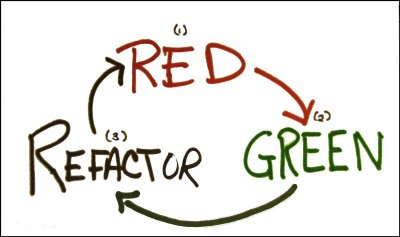

title: TDD or not TDD 
author: Jacek Młynek

!SLIDE

## Agenda

* #### Tic tac toe in any approach but not in TDD 
* #### Idea behind TDD
* #### TDD recipe
* #### TDD benefits
* #### Common TDD mistakes
* #### Tic tac toe in TDD manner
* #### Comparing approaches
* #### Local optimum problem 

!SLIDE 

## Tic Tac Toe

<% left do %>

<% end %>

<% right do %>

* #### a game is over when all fields are taken
* #### a game is over when all fields in a column are taken by a player
* #### a game is over when all fields in a row are taken by a player
* #### a game is over when all fields in a diagonal are taken by a player
* #### a player can take a field if not already taken
* #### players take turns taking fields until the game is over

<% end %>

# It Is Time For Tic Tac Toe Coding Kata!

!SLIDE

## Don't Trust Definitions

>  Definition is easy to remember and too easy to interpret in wrong way
>                                                     
> ~ Me - some time ago

!SLIDE

## Idea Behind TDD

    Correct behavior plus correct structure. TDD tells us to first focus on making the software work correctly; and then, and only then, to focus on giving that working software a long-term survivable structure. This is all because our minds are not great with doing two different things simultaneous.
                                          
                                                    ~ The Clean Code Blog

.

    Validate your code in front of client as soon as possible.

    Your test case is a first client of your code, first place when you can check your assumption and change them if they are not good enough.

!SLIDE

## Red, Green, Refactor - TDD Recipe

<% left do %>

<% end %>

<% right do %>

<% step do %>
Cycle:

* Create a unit tests that fails
* Write __production__ code that makes that test pass
* Clean up the mess you just made
<% end %>

<% step do %>

Rules:

* You must write a failing test before you write any __production__ code.
* You must not write more of a test than is sufficient to fail, or fail to compile.
* You must not write more __production__ code than is sufficient to make the currently failing test pass.

<% end %>
<% end %>

!SLIDE

## TDD Benefits 
 
    You design your system inside out instead of upfront 

.

    You trust your code

.
    
    You are not afraid to change code

.    

    You describe your code piece by piece

# Common TDD mistakes 

!SLIDE

## Lack of tools or domain knowledge

### Problem 

You start writing a test without sufficient domain or tools (e.g. test tool ) knowledge, you stop writing a test and you start writing production code to be more comfortable with a problem. You end up with potentially not tested code.

### Solution 

Is simple. Don't let your lack of knowledge drive production code. Stop coding, start learning your domain, write snippets to get better with tools, do what ever you want but leave production code untouched.

!SLIDE 

## Too many assumptions

### Problem

Before you even start writing a test you make a lot of domain assumptions like: I will need `Foo` object collaborating with `Bar` which inherit from `BarBase`. It can lead to situation when you end up with a code which you don't need and for the next couple of hours you will try to defence it.

### Solution 

Keep it simple as possible. Naive solution is nothing bad.

!SLIDE

## Too many thoughts at once

### Problem 

It is often happen to me. I don't have finished one problem but jump to another one and another.

### Solution

Do one thing at time. I have founded out Pair Programming very useful in this case. If I recognize above scenario I ask my colleague to code with me.
 

!SLIDE

## Force to have 100% coverage 

### Problem 

100% code coverage is nothing bad, it is highly appreciated. But motivation behind it can be a problem. If code coverage is the only one code quality attribute or the most important one you can easy miss very important test role:

    Test in first place should explain your intention!

### Solution  

You are not machine deal with this. Focus on staff in which your are better than simply machine.

!SLIDE 

## Asking manager for permition

### Problem

You want to do TDD but you know that it increase estimation so you ask you manager. In most cases managers doesn't understand true benefits (they are simply not technical people) and they say no.

### Solution

Don't ask just do. If you want to use some design pattern which can help with code design and future maintenance do you go to manager or when you want to write ten more classes instead of one big one, do you go to manager and ask about permission? If not why you have to do that in this case? 

!SLIDE

## Lets define a good test

* It is composed of three "sections": Arrange, Act, Asserts (AAA)
* It is clear and simple. Naive is better than complex
* _It is focuse on one thing_
* It should not be expose all code details - not coupled to much to code
* It should explain test case in human readable way. In classic approach we are naming test method with pattern:
    
    PublicMethodName_Context_Result

Examples of test methods names:

* Accept_QuoteIsNotObtain_ShouldThrowExcaption
* CreateQuote_ProductIsPropertyAndBuildYearIsNull_ShouldReturnValidationError
* GetAllQuotes_RepositoryIsEmpty_ShouldReturnEmptyCollection

# Now It Is Time For TDD Kata

# Comparing solutions

!SLIDE 

## Local optimum problem

### Problem 

Sometimes when you are writing code in RGR loop you can lose "Big picture", business reason that you are creating more and more classes. It can ends up with functionality that your client doesn't need and you will have to maintenance.

### Solution

BDDD - coming next :)

!SLIDE

## Resources

* #### Test Driven Development: By Example, Kent Beck, 2002
* #### https://pragprog.com/screencasts/v-kbtdd/test-driven-development
* #### http://blog.cleancoder.com/http://gojko.net/2009/08/02/tdd-as-if-you-meant-it-revisited/
* #### http://gojko.net/2009/08/02/tdd-as-if-you-meant-it-revisited/
