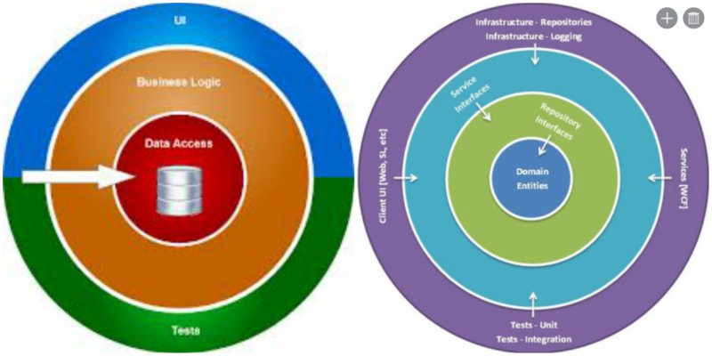
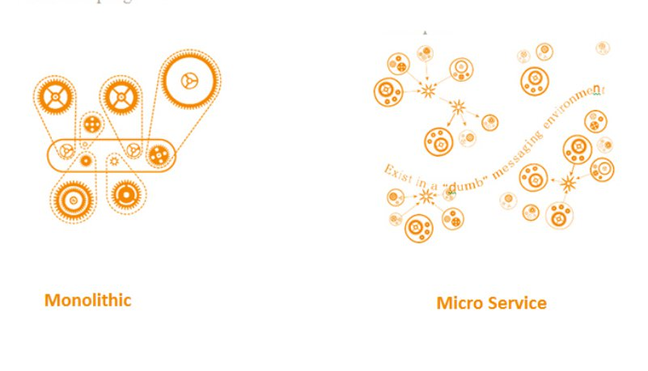
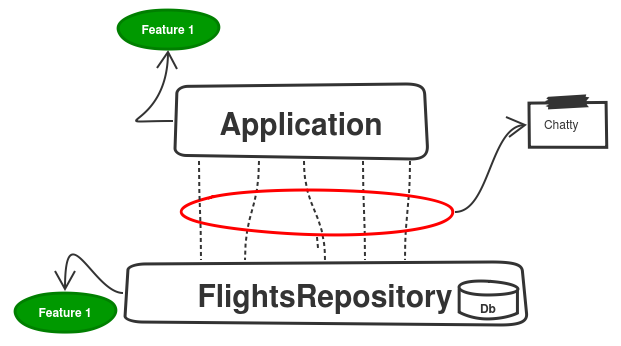
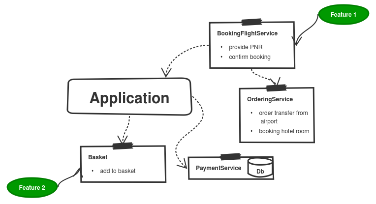
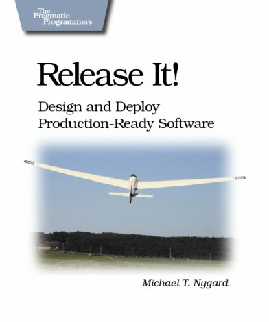
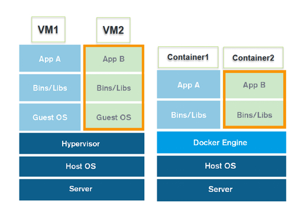
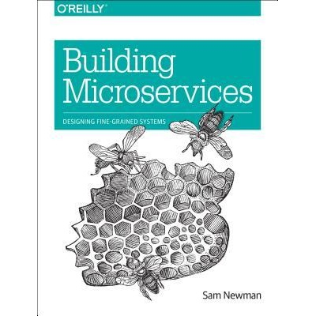

title: Microservices 
author: Jacek Młynek

!SLIDE

## Agenda

* #### What is it all about
* #### Definition
* #### How does a good Microservice should look like
* #### Benefits 
* #### Common Pitfalls
* #### Deployment
* #### Who already invested in Microservices

!SLIDE

## Microservices Buzzing

    Buzzwords are first sign of professional support! 

!SLIDE

## Don't Trust Definitions

>  Definition is easy to remember, easy to share and too easy to interpret in wrong way.
>
> ~ Me - some time ago

# Evolution - Idea Behind Micro World

!SLIDE

## Evolution From Procedural To Object Oriented

!SLIDE

## Evolution From Nested Inheritance To Composition

!SLIDE

## Evolution From Three Layers To Many

!SLIDE

% Rollback
% monolithic application hard to find out some stuff
% when one assieblie not work

## Evolution From Monolith Application To ...

# What Is The Common Motivation Behind?

# Maintainability - add a feature without breaking others
% Separeate What Change Often From What Changes Rarely

# How To Write Well Maintainable Code?

# Modularity

!SLIDE

## Unix - The Most Modular System

>This is the Unix philosophy: Write programs that do one thing and do it well. Write programs to work together. Write programs to handle text streams, because that is a universal interface
>
> ~ Douglas McIlroy

# ls | grep "microservices"

!SLIDE

##  Evolution From Monolithic Layered Application To Microservices

# Microservices are small autonomous services that work together.

# How Does a Good Microservice should look like
% think about add new title slide and split this point to new slides

!SLIDE

## How Small is Micro

    Someone from ThoughtWorks said that it should not be bigger than his head

.

    Someone else claims that it should not have more than 1000 lines of code

.

    Think about the team structure. If the code is too big to maintenance by a small team - splitting it can be a good move.

.

    Something which could be rewritten in two weeks

!SLIDE

## Autonomous In Context of Services

* #### Change independently, deployed independently without affecting its clients
* #### All communication between services via network:
  * like in TDD let us design from inside to outside
  * enforce separation
* #### One Microservice onto one machine although machine is a tricky word today.
  * overhead
  * easier to manage problems, easier to distribute especially with new tools
* #### Public interface as API and all services communicate with each other via these APIs 

# Benefits

!SLIDE 

## Cherry pick deployment. 

    Deploying things that has changed instead of whole system, reduce a risk that we introduce new bugs to PROD.

!SLIDE

## Scaling
% Moze jakis obrazek

    Scaling smaller parts of whole system not just a whole system. 
 
  
    In most cases you don't have to have performance constrains on the whole system. Just some parts need more powerfull hardware.

!SLIDE

## Look At Future Without A Fear!

### How many times you decide to change architecture behind your system?

### How many times you decide to rewrite or refactor your codebase?

### If rarely or not at all, you probably are afraid of:
* it will take you ages
* it takes a lot of money
* it is too risky, can introduce a lot of bugs

.
 
    Small independent head of controls takes it from you. Now you can change one part of you system or even completely rewrite without so much fear.

!SLIDE

## Power of flexibility

    The same standards are mandatory. Without them is hard to imagine any kind of communication. 

.

    Difference is what makes things special and powerful.

. 

    Microservices communicate using well defined protocols and APIs as public interfaces. However because they are head of controls they can be written in any technology you want. This allows you to pick the right tools for the problem.
 

!SLIDE

## Improve team organization

    When you have small code base, you can minimize number of people working on it.

.

    Smaller teams are more productive

!SLIDE

## Reusability 

    If you have clear API as public interface of your services and well know communication protocol, your internal parts can be much easier to reuse comparing to big monolith systems. 

.

    Right now when IoT is big buzzing word you never now when your internals become public or when you enable another channel of distribution.

# Pitfalls 

# Slicing

!SLIDE

## Slicing - Problem Definitions

    Slicing by technical boundary is horizontal. In many cases when you will change some thing in front you will have to change it also in back. One change means two services to be deployed

!SLIDE 

## Solution

### Bounded Context is King!

    A Bounded Context is an explicit boundary within which a domain model exists. Inside the boundary all terms and phrases of the Ubiquitous Language have specific meaning, and the model reflects the Language with exactness.

!SLIDE

## Solution Domain Slices

# Communication Based on Shared Libraries. 

!SLIDE

## Problem Definition

### Exposing your internal structure 

    It is risky because across bounded context the meaning of the model can change. Account in Ordering service is something different that Account in User service.

### Communication based on serialized shared libraries

    Imagine that you have changed version of your shared library. Will it break your service communication? Good example can be a WSDL-binding. 

!SLIDE

## Solution

> Be conservative in what you do, be liberal in what you expect
> 
> Postel's law

* #### Distinguish between external and internal representation
* #### Expose just minimum
* #### Model interpretation should be internal aspect. 
* #### Don't use WSDL use XPath

# Shared Database

!SLIDE 

## Problem

    Two services are writing and reading to the same table. Every time you change service A you can want to change DB. How you will know the impact on service B?

!SLIDE

## Solution 

    Each service should own its own data

* ### Split db, create two schemas. It still can be the same db instance.

* ### Hide db behind one of these services and make all db operations through it.

* ### I found out CQRS pattern to be very helpful in this case.

!SLIDE

## Solution 

### It is very painful problem, definitely worth exploring more!

# Breaking changes

!SLIDE

## Problem

    No matter how much you try you can introduce Breaking Change!
    You should adopt some mechanisms which can at least warn you. 

!SLIDE

## Solution 

### Two thing which can be helpful:

* #### Consumer Driven Contract
* #### Distinguish between deployment and release.

!SLIDE

## Solution - Consumer Driven Contract

!SLIDE

## Solution Deployment != Release

# Performance Issue

!SLIDE

## Problem 

    A lot of small services communicating via network will slow down your applications. The main problem is that you probably don't know how fast your application should be!

!SLIDE

## Solution

* ### Measure it! Monitoring, load tests are must have in MicroWorld
* ### Because one "machine" contains one service you can easily locate source of your performance problems and solve the root cause.

!SLIDE

## Recap What We Have Already Known

* #### Microservice should be small
* #### Microservices should be cohesive and loosely coupled
* #### Use bounded context to slice your services 
* #### Microservice should be deployed independently
* #### One microservice onto one machine

# Continuous Deployment Tools

!SLIDE

% zamienic z obrazkiem jak starczy czasu

<% left do %>
## Provisioning

* ### Puppet
* ### Chef
* ### Ansible

<% end %>

<% right do %>

## Virtualization

* ### AWS
* ### Vagrant
* ### VMWare
* ### OpenStack

<% end %>

## Connector

* ### Packer

!SLIDE

## Benefits

* ### Immutable servers - we store all configuration in source control
* ### Reproduce PROD
* ### It gives us the power to handle failures.
* ### Fast machine start up.

!SLIDE

## Drawbacks

* ### Build images can take long time especially for the first time
* ### Some of the images can be large

!SLIDE

## Docker, Container Example

!SLIDE

## Who Already Invested in Micro World

# Golden Rule 

!SLIDE

>The golden rule: you make a change to a service and deploy it without changing anything else.
>
> ~ Sam Newman

# Thank You!

