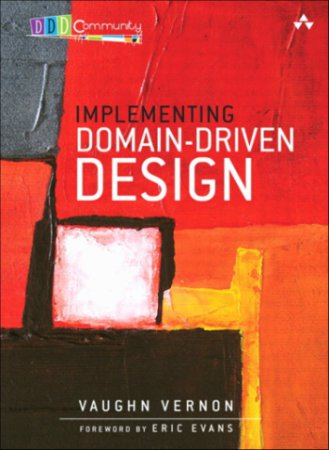

title: Microservices 
author: Jacek Młynek

!SLIDE

## Agenda

* #### What is all about
* #### Definition
* #### How  good microservice should looks like
* #### Benfits 
* #### Common Pitfals
* #### Deployemnt
* #### Who alread invested in Microservices?

!SLIDE

## Microservices Buzzing

    Buzzwords are first sign of professional support! 

!SLIDE

## Don't Trust Definitions

>  Definition is easy to remember, easy to share and too easy to interpret in wrong way.
>
> ~ Me - some time ago

# Evolution - Idea Behind Micro World

!SLIDE

## Evolution From Proceduar To Object Oriented

!SLIDE

## Evolution From Nested Inheritance To Composition

!SLIDE

## Evolution From Three Layers To Many

!SLIDE

% Rollback
% monolithic application hard to find out some stuff
% when one assieblie not work

## Evolution From Monolith Applicatio To ...

# What Is The Common Motivation Behind?

# Maintainability - add a feature without breaking others
% Separeate What Change Often From What Changes Rarely

# How To Write High Maintainable Code?

# Modularity

!SLIDE

## Unix - The Most Modular System

> This is the Unix philosophy: Write programs that do one thing and do it well. Write programs to work together. Write programs to handle text streams, because that is a universal interface
>
> ~ Douglas McIlroy

# ls | grep "microserices"

!SLIDE

##  Evolution From Monolithic Layered Application To Microservices

# Microservices are small autonomus services that work together.

# How Microservice should looks like
% think about add new title slide and split this point to new slides

!SLIDE

## How Small is Micro

    Someone from ThoughtWorks said that it should not be bigger that his head

.

    Another claims that it should not have more than 1000 lines of code

.

    Thing about the team structure. If code is to big to maitenance by small team trying to split it can be good move.

.

    Something which could be rewritten in two weeks

!SLIDE

## Autonomus In Context of Services

* #### One microservices onto one machine althought machine is a trick word today.
  * overhead
  * easier to manage problems easier to distributed if we have infrastructure for that
* #### All comunication between services via network:
  * like in TDD let us desgin form inside to ouside
  * enforce separation
* #### Change independly, deployed independly without affectic its clinets
* #### Public interface as API and all services comunicate with each others via thoes APIs 

# Benefits

!SLIDE TODO 

## Chery pick deployemnt. 

    Deploying things that has changed instead of whole system, reduce a risk that we introduce new bugs to PROD.

!SLIDE

## Scaling
% Moze jakis obrazek

    Scaling smaller parts of whole system not just whole system. 
 
  
    In most cases you dosen't need to have perfocmance constrains on whole system. Just some parts need more powerfull hardware.

!SLIDE

## Look At Future Without A Fear!

### How many times you decide to change architecture behind your system?

### How many times you decide to rewritte or refactor your codebase?

### If not often or not at all, you are propably aftraid of:
* it will takes you ages
* it takes a lot of money
* it is too riski, can itroduce a lot of bugs

.
 
    Samll idepended head of controls takes it from you. Now you can change one part of you system or even completle rewritte without so much fear.

!SLIDE

## Power of flexibility

    The same standarts are must have. Without it is hard to imagin any kind of communication. 

.

    Differences is what make things special and powerful.

. 

    Microservices communicate using well defined protocols and API as public interfaces. However because they are head of controls tehy can be write in any technology you want. This allow you to pick right tools for problem.
 

!SLIDE

## Improve team organization

    When you have small code base, you can minimalize number of peopel working on them.

.

    Samller team are more productive

!SLIDE

## Reusability 

    If you have clear API as public interface of your services and well know communication protocol, your internal parts can be much more easier to reause compering to big monolith system. 

.

    Right now when IoT is big buzzing world you never now when your internals become public or when you eneble another chanel of distribution.

# Pitfalls be careful 

# Slicing

!SLIDE

## Slicing - Problem Definitions

% Add image with appliction data acces and db 

    Slicing by technical boundary is horizontal. In many cases when you will change some thing in front you will have to change it also in back. One change two service to deployed

!SLIDE 

## Slicing - Solution

### Bounded Context is King!

> A Bounded Context is an explicit boundary within which a domain model exists. Inside the boundary all terms and phrases of the Ubiquitous Language have specific meaning, and the model reflects the Language with exactness.

# Spiders 

!SLIDE

## Spiders - Problem definition 

!SLIDE

## Spliders - Solution

    Split you spider so just your composition root will know all parts 

# Communication Based on Shared. 

!SLIDE

## Problem Definition

### First is exposing your internal structure 

    It is risky because accross bounded context mining of model can change. Acccount in Ordering service is somthing diffrent that Account in User service.

### Second Set up communication base on serialized shared libraries

    Imagin that you have changed version of your shared library. It will broke your service communication? Good example can be a WSDL-binding. 
.
 
!SLIDE

## Solutions

> Be conservative in what you do, be liberal in what you expect
> 
> Postel's law

* #### Distinquish between external and internal representation
* #### Expose just minimum
* #### Model interpretation should be internal aspect. 
* #### Don't use WSDL use XPath

# Shared Database

!SLIDE 

## Problem

    Two services are wrting and reading to the same table. Every time i change service A i can want to change DB. How i can know the impact on service B?

.

    It is not easy definetly worth additional hours

## Solutions 

    Each service should owns its own data

### Split db, create two scheams. It still can be the same db instance.
### Hide db behind one of this servises and make all db operation throught it.
### I found out CQRS pattern to be very helpful in this case.

# Breaking changes

## Problem

    No matter how much you try you can introduce Breaking Chance!
    You should adopte some mechanisms which can at least warn you. 

## Solution 

### Two thing which can be helpful:
* #### Consumer Driven Contract
* #### Distinguish between deploying thing and releasing it.

## Solution - Consumer Driven Contract

## Solution Deployment != Releasing

# Performance Issue

!SLIDE

## Problem 

!SLIDE

## Solution

!SLIDE

## Recap What We Have Already Known

* #### Microservice should be small
* #### We know that bunded context is very useful in case of slicing choesion and lose couple services!
* #### Microsevice should be deployed independly
* #### One microservice onto one machine

# Continus Deployment Tools

!SLIDE

% zamienic z obrazkiem jak starczy czasu

<% left do %>
## Provisioning

* ### Puppet
* ### Chef
* ### Ansible

<% end %>

<% right do %>

## Virtualization

* ### AWS
* ### Vagrant
* ### VMWare
* ### OpenStack

<% end %>

## Connector

* ### Packer

!SLIDE

## Benefits

* ### Immutable servers - we store all configuratio in source controle
* ### Reproduce PROD
* ### It give us power to handle failures.
* ### Fast machine start up.

!SLIDE

## Drawbacks

* ### Build images can take long time especially for the firs time
* ### Some of the images can be large

!SLIDE

## Docker, Container Example

!SLIDE

## Who Already Invested in Micro World

# Golden Rule 

!SLIDE

>The golden rule: you make a change to a service and deploy it without changing anything else.
>
> ~ Sam Newman

# Thank You!

